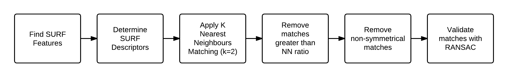

Object Recognition
==================

A prototype of an object recognition system using OpenCV/Kinect camera. This code was created as part of a larger proof of concept honours project involving an industry partner (). A large portion of the project involved researching popular computer vision algorithms and technologies at the time (2012).

It is able to identify particular known objects in video frames. However, please note, it is nowhere near the performance of CNNs found today!

The 'Pipeline'
--------------

Class Diagram
-------------

